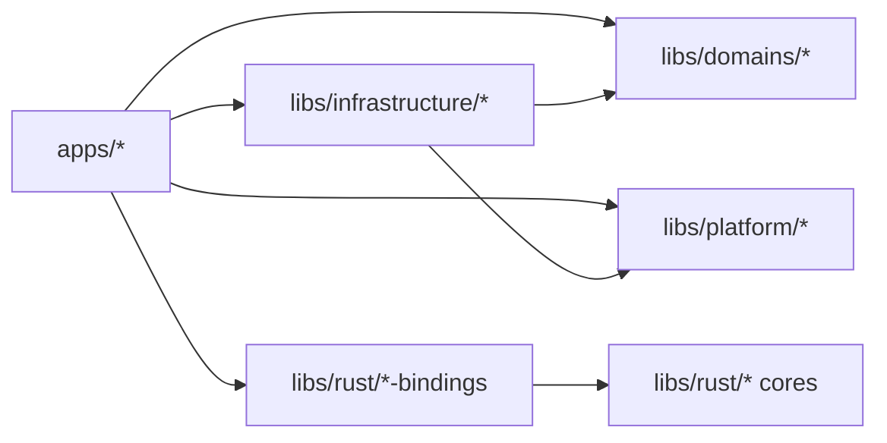

# Agentic Monorepo

[](https://github.com/fayez-nazzal/agentic-monorepo/actions/workflows/ci.yml)
[](LICENSE)

**A starter monorepo for TypeScript, Swift, and Rust, with a CLI that creates one in a single command.**

Agentic Monorepo is an [Nx](https://nx.dev) and [pnpm](https://pnpm.io) workspace. Each business domain has its own library and small public interface. An automated boundary check enforces the architecture, and every project provides the same `build`, `typecheck`, `test`, and `lint` targets. Grouping code by business capability instead of technical layer lets a developer or AI coding agent work in one domain without loading the whole repository.

Use `create-agentic-monorepo` to create a repository with only the starters you choose: a web app, a Node CLI, a native macOS app, an independent Rust library, or the workspace alone.

## Quick start

You need [Node.js](https://nodejs.org) 22.13 or newer and [pnpm](https://pnpm.io/installation) 11.21.0. The web and CLI starters need nothing else and work on macOS, Linux, and Windows.

### 1. Create your repository

```sh
npx create-agentic-monorepo@latest my-product
```

Alternatively:

```sh
pnpm create agentic-monorepo@latest my-product
```

The wizard asks where to create the repository, which starter to use, and whether to install dependencies and initialize Git. It shows exactly what it will do before writing any file. The destination must be a new or empty directory, and it never overwrites files.

Already know what you want? Skip the questions:

```sh
npx --yes create-agentic-monorepo@latest my-product --preset web --yes
```

### 2. Start developing

```sh
cd my-product
pnpm install --frozen-lockfile
pnpm nx run web-example-app:dev
```

Vite prints a local URL. Open it to see the example app display results from the shared search domain. Replace that domain with your own and continue building.

Node >=22.13 runs the creator. Generated-workspace installs need pnpm 11.21.0.

> [!TIP]
> `--list` shows every starter, `--dry-run` prints the plan without creating anything, and `--install --git` lets the CLI run `pnpm install --frozen-lockfile` and `git init` for you.

## Choose a starter

| Preset      | You get                                                                         | Also needs                                 |
| ----------- | ------------------------------------------------------------------------------- | ------------------------------------------ |
| `web`       | `apps/web/example-app` (TypeScript + Vite) and the shared `libs/domains/search` | —                                          |
| `cli`       | `apps/cli/example-app` (Node + TypeScript) and the shared `libs/domains/search` | —                                          |
| `mac`       | `apps/mac/example-app` (SwiftUI) and `libs/platform/mac/filesystem`             | macOS 14+, Swift 6, SwiftLint              |
| `web-cli`   | The web and CLI apps sharing one search domain                                  | —                                          |
| `full`      | All three apps plus the independent `libs/rust/search-index`                    | macOS 14+, Swift 6, SwiftLint, Rust 1.97.1 |
| `workspace` | Workspace tooling, configuration, CI, and architecture docs, with no app yet    | —                                          |

Every starter includes the pinned toolchain, the boundary check, and a CI workflow chosen for your selection. Build your own combination with `--apps web,cli,mac` (or `--apps none`) and `--rust`; for example, `--apps cli --rust`.

The Rust library is independent by design: it is a standalone crate, not a binding connected to an app.

<details>
<summary>Starters that are listed but not available yet</summary>

React, Next.js, Vue, SvelteKit, Astro, Node API, iOS, Android, Expo, Electron, Tauri, and Rust application bindings appear in `--list` as **Coming soon**. They are not available yet, so the CLI rejects them instead of generating a broken project.

</details>

## CLI options

| Option                | What it does                                                                                                                         |
| --------------------- | ------------------------------------------------------------------------------------------------------------------------------------ |
| `[destination]`       | Directory to create; must be new or empty. Its name becomes the default package name.                                                |
| `--preset <id>`       | `web`, `cli`, `mac`, `web-cli`, `full`, or `workspace`                                                                               |
| `--apps <csv>`        | Any mix of `web`, `cli`, `mac`, or `none`                                                                                            |
| `--rust`, `--no-rust` | Include or exclude the independent Rust library                                                                                      |
| `--name <name>`       | Root package name in lower-kebab-case                                                                                                |
| `--install`, `--git`  | After the files are written, run `pnpm install --frozen-lockfile` and `git init --initial-branch=main`; both stay off unless you ask |
| `--config <path>`     | Reuse a saved `agentic.config.json`                                                                                                  |
| `--yes`, `-y`         | Never prompt; falls back to the `web` preset when no starter is given                                                                |
| `--dry-run`           | Print the plan and write nothing                                                                                                     |
| `--json`              | Print one machine-readable result on stdout                                                                                          |
| `--plain`             | Line-based ASCII prompts for limited terminals                                                                                       |
| `--list`              | Print the starters and capabilities, then exit                                                                                       |
| `--help`, `--version` | Usage and version                                                                                                                    |

## Repeat a setup

Every generated repository contains an `agentic.config.json` with the resolved name, selected apps, Rust choice, and the template version and digest used to create it. Feed this file back to reproduce the same repository:

```sh
npx create-agentic-monorepo@latest my-other-product --config ./agentic.config.json
```

Explicit flags take precedence over the file. If its recorded version or digest no longer matches, the command stops instead of quietly generating something different. When replaying an older template, replace `latest` with the config's `templateVersion`. Dependency installation and Git setup are not recorded, so add `--install` or `--git` when you want them.

## Architecture

Folders follow the business area, not the framework.

| Purpose                          | Location                                                |
| -------------------------------- | ------------------------------------------------------- |
| Business rules for one domain    | `libs/domains/<domain>`                                 |
| Wrapper around one OS capability | `libs/platform/<platform>/<capability>`                 |
| Persistence and networking       | `libs/infrastructure/<capability>`                      |
| Rust cores and their bindings    | `libs/rust/<crate>` and `libs/rust/<crate>-<ecosystem>` |
| Product entry points             | `apps/<platform>/<app>`                                 |
| Repository automation            | `tools`                                                 |

- Apps compose libraries and own no reusable business logic.
- A domain library depends only on libraries in its own domain.
- Rust cores stay FFI-free; binding crates own the language-crossing edge.
- Nothing depends on an app.



`tools/check-boundaries.mjs` reads the Nx graph and project tags, then fails the `lint` target when a dependency breaks these rules. The [architecture guide](docs/architecture.md) explains where projects belong and which dependencies are allowed.

Before adding a project or concept, write an ordered plan and run `node tools/check-boundaries.mjs --preflight plan.json`. It prints a `LEGAL` or `BLOCKED` verdict for every entry and writes nothing; use `pnpm preflight:tui` for interactive planning. Treat `BLOCKED` as a stop and follow the smallest allowed change in the diagnostic. The full procedure, including human-reviewed ownership transfers and same-name concepts across domains, is in [`docs/architecture.md`](docs/architecture.md).

## Example projects

| Project                                                        | What it is                                                   |
| -------------------------------------------------------------- | ------------------------------------------------------------ |
| [`apps/web/example-app`](apps/web/example-app)                 | Vanilla TypeScript browser app built with Vite               |
| [`apps/cli/example-app`](apps/cli/example-app)                 | Node command-line app that formats a search query            |
| [`apps/mac/example-app`](apps/mac/example-app)                 | Native SwiftUI app targeting macOS 14+                       |
| [`libs/domains/search`](libs/domains/search)                   | Pure TypeScript search domain shared by the web and CLI apps |
| [`libs/platform/mac/filesystem`](libs/platform/mac/filesystem) | SwiftPM library for macOS filesystem locations               |
| [`libs/rust/search-index`](libs/rust/search-index)             | Standalone Rust library for search indexing                  |

The examples are meant to be replaced. To make the repository yours:

1. Name libraries after business capabilities, not technical layers.
2. Keep reusable rules inside domain libraries and let apps combine them.
3. Tag every new project with its type, domain, platform, and language so the boundary check can protect it.

## Everyday commands

| Task                            | Command                                         |
| ------------------------------- | ----------------------------------------------- |
| Install exactly the pinned tree | `pnpm install --frozen-lockfile`                |
| Verify every project            | `pnpm nx run-many -t typecheck build test lint` |
| Format, or check formatting     | `pnpm format`, `pnpm format:check`              |
| Explore the project graph       | `pnpm nx graph`                                 |
| Run a single target             | `pnpm nx run <project>:<target>`                |

Each project README lists its own targets. Nx runs upstream builds before `typecheck`, `test`, `lint`, and `build`, and caches those TypeScript tasks; Swift and Rust builds are left to their own toolchains. Development targets are also build-gated through root `targetDefaults`: `dev` and `serve` build upstream dependencies, while `preview`, `start`, and `run` build the project first.

## Toolchain

| Tool                             | Role                                                | Version                                 |
| -------------------------------- | --------------------------------------------------- | --------------------------------------- |
| Node.js                          | Runtime for the workspace tooling and CLI starter   | 22.13 or newer                          |
| pnpm                             | Workspace installs with strict dependency isolation | 11.21.0, pinned by `packageManager`     |
| Nx                               | Project graph, task running, caching                | pinned in `package.json`                |
| TypeScript, Vite, Vitest, tsdown | Types, web dev and build, tests, library bundles    | pinned in `package.json`                |
| oxlint, oxfmt                    | Semantic linting, formatting and import order       | pinned in `package.json`                |
| Swift, SwiftPM, SwiftLint        | Native macOS code, only for the Mac starter         | Swift 6 tools, macOS 14 baseline        |
| Rust, Cargo, Clippy, rustfmt     | Native library work, only for the Rust selection    | 1.97.1, pinned by `rust-toolchain.toml` |

JavaScript dependencies are pinned to exact versions, and `minimumReleaseAge: 2880` in `pnpm-workspace.yaml` keeps releases younger than 48 hours out of resolution.

## Working on this repository

For an unreleased local CLI, clone and build the repository, then invoke the staged entry point:

```sh
git clone https://github.com/fayez-nazzal/agentic-monorepo.git
cd agentic-monorepo
pnpm install --frozen-lockfile
pnpm nx run create-agentic-monorepo:build
node apps/cli/create-agentic-monorepo/dist/package/dist/main.mjs ../my-product
```

These are the commands CI runs on macOS:

```sh
pnpm install --frozen-lockfile
pnpm nx run-many -t typecheck build test lint
pnpm format:check
```

The full sweep includes the Swift and Rust projects, so it needs macOS 14 or newer with Swift 6 and SwiftLint plus the pinned Rust 1.97.1 toolchain; the web and CLI projects alone need only Node and pnpm. CI also packs the CLI and creates a repository from the packed artifact on Ubuntu, Windows, and macOS. Read the [architecture guide](docs/architecture.md) before adding a project.

### Publishing the CLI

Bootstrap publication requires npm authentication:

1. Run `npm login --registry=https://registry.npmjs.org` and complete any browser or MFA challenge.
2. From the repository root, build the staged package with the contributor commands above.
3. Publish the tested directory: `npm publish ./apps/cli/create-agentic-monorepo/dist/package --access public --tag latest --registry=https://registry.npmjs.org`.
4. In npm package Settings → Trusted publishing, add GitHub Actions for organization/user `fayez-nazzal`, repository `agentic-monorepo`, workflow filename `publish-create-agentic-monorepo.yml`, with no environment restriction. Allow direct `npm publish`, not only the default stage operation.
5. Verify the package with `npm view create-agentic-monorepo version --registry=https://registry.npmjs.org`.

For future releases, change only the creator's source version, merge with passing CI, then publish a stable GitHub Release tagged `create-agentic-monorepo-v<version>` at that commit. The workflow checks the tag and publishes to `latest` with npm trusted publishing.

## License

[MIT](LICENSE). Built to be forked.
